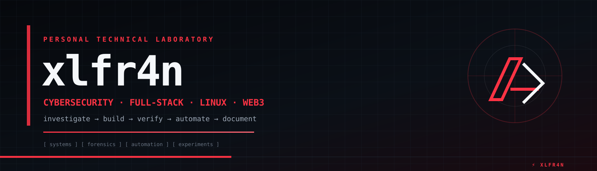

<!-- xlfr4n // personal GitHub identity -->

  

  <strong>⚡ xlfr4n</strong> 
  Cybersecurity · Full-Stack · Linux · Web3 · Automation

  
  
  

  

---

## ⚡ whoami

### 🇪🇸 Español

Soy **xlfr4n**.

Construyo herramientas y sistemas alrededor de **software, automatización, Linux, seguridad, Web3 y análisis técnico**. Mi GitHub funciona como un laboratorio personal: no solo quiero que algo funcione; quiero poder **entenderlo, probarlo, reproducirlo y documentarlo**.

<strong>Build → Understand → Verify → Automate → Document.</strong>

### 🇬🇧 English

I'm **xlfr4n**.

I build projects around **software, automation, Linux, security, Web3 and technical analysis**. I treat GitHub as a personal laboratory: I don't just want something to work — I want to **understand it, verify it, reproduce it and document it**.

<strong>Build → Understand → Verify → Automate → Document.</strong>

---

## 🧠 What I work with

  

| Area | Focus |
|---|---|
| 🛡️ Security | Web security, defensive tooling, technical investigation |
| 🔬 Forensics | Static analysis, reconstruction, reproducible research |
| 🐧 Linux | Kali, BSPWM, shell tooling, automation and custom environments |
| 🌐 Web | Next.js, React, TypeScript, Supabase, Vercel |
| ⛓️ Web3 | Ethereum, Immutable, wallets, NFT / collectibles data |
| 🤖 Automation | Scripts, CLI workflows, data pipelines and developer tooling |

---

## 🚀 Selected work

### 🖥️ Kali BSPWM 2026
**A personal Kali Linux desktop layer built around BSPWM, automation and the <code>xlfr4n</code> identity.**

<code>BSPWM</code> · <code>SXHKD</code> · <code>Polybar</code> · <code>Rofi</code> · <code>Kitty</code> · <code>Picom</code> · <code>Zsh</code> · <code>VirtualBox</code>

→ [Open the project](https://github.com/xlfr4n/kali-bspwm-2026)

### 🔎 desencryp
**Forensic analysis and reconstruction work with an emphasis on traceability and reproducibility.**

<code>JavaScript</code> · <code>Forensics</code> · <code>Static Analysis</code> · <code>Reverse Engineering</code>

→ [Open the project](https://github.com/xlfr4n/desencryp)

### 🤖 DevsAI
**Web platform work combining AI, community features, automation and modern full-stack development.**

<code>Next.js</code> · <code>React</code> · <code>TypeScript</code> · <code>Supabase</code> · <code>Vercel</code>

→ [Open the project](https://github.com/xlfr4n/DevsAI)

### 💎 HabboPortfolioPro
**Portfolio tooling for Habbo Collectibles and blockchain-backed asset data.**

<code>Web3</code> · <code>Ethereum</code> · <code>Immutable</code> · <code>Portfolio Data</code>

→ [Open the project](https://github.com/xlfr4n/HabboPortfolioPro)

### 📡 Habbo Furni Radar
**Tracking and discovery tooling for new Habbo Collectibles.**

<code>Automation</code> · <code>Data</code> · <code>Habbo Collectibles</code>

→ [Open the project](https://github.com/xlfr4n/habbo-furni-radar)

---

## 🎮 ./play

I wanted the profile to have something that is actually **interactive**, not just another wall of badges.

### ⚡ MICRODOOM

A tiny original browser FPS/raycaster made specifically for the profile.

- 🖥️ Desktop: keyboard controls
- 📱 Mobile: touch controls
- 🔥 Original code/assets — no Doom game files included
- 🧪 Small technical playground rather than a full game

**Play:** [xlfr4n // MICRODOOM](https://xlfr4n.github.io/xlfr4n/play/)

> If the Pages URL has not been activated yet, the game source is available at [play/index.html](./play/index.html).

---

## 🧪 My lab

<strong>Open the lab workflow</strong>

<strong>[01] INVESTIGATE</strong> → understand the problem

<strong>[02] BUILD</strong> → create the smallest useful system

<strong>[03] VERIFY</strong> → test what actually happened

<strong>[04] AUTOMATE</strong> → remove repetitive work

<strong>[05] DOCUMENT</strong> → leave a reproducible trail

I prefer **evidence over assumptions**, **reproducible steps over magic**, and **useful tooling over decoration**.

---

## 🧩 Projects by laboratory

<strong>🛡️ Security / Forensics</strong>

- Web security research
- Static JavaScript analysis
- Runtime reconstruction
- Defensive scripts and investigation tooling
- Reproducible forensic notes

<strong>🐧 Linux / Systems</strong>

- Kali Linux environments
- BSPWM desktop engineering
- Shell automation
- Virtual machine integration
- CLI tooling and system diagnostics

<strong>🌐 Full-Stack / Web3</strong>

- Next.js / React applications
- Supabase backends
- Vercel deployments
- Ethereum / Immutable data
- NFT and collectibles portfolio tooling

---

## 📊 GitHub

  

  Public work is only one part of the lab. Some experiments are private, unfinished or intentionally kept local.

---

## 🧭 Philosophy

> **Make it work.**
>
> **Understand why it works.**
>
> **Prove that it works.**
>
> **Make it reproducible.**
>
> **Then make it yours.**

---

## ⚡ xlfr4n

  <strong>One signature. Different laboratories.</strong> 
  Una firma. Diferentes laboratorios.

  <a href="https://github.com/xlfr4n">GitHub</a> ·
  <a href="https://github.com/xlfr4n?tab=repositories">Repositories</a> ·
  <a href="https://github.com/xlfr4n/kali-bspwm-2026">Kali BSPWM</a> ·
  <a href="https://github.com/xlfr4n/desencryp">Forensics</a> ·
  <a href="https://github.com/xlfr4n/DevsAI">DevsAI</a>

  

